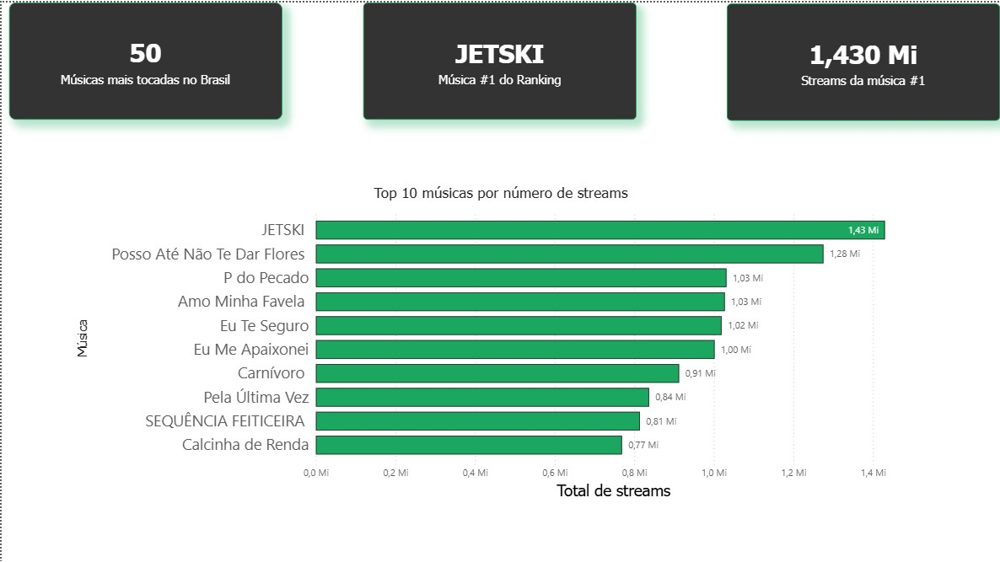
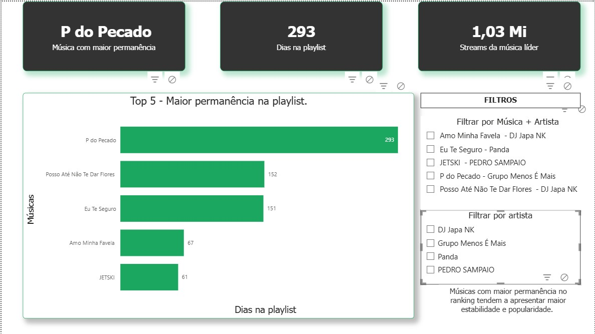

# 🎧 Spotify Top 50 Brasil - Dashboard de Análise de Dados (Power BI)

Projeto de análise de dados utilizando Power BI com foco em visualização e geração de insights a partir de dados do Spotify.

## 📌 Contexto do Projeto

Projeto de análise de dados utilizando Power BI para explorar o comportamento das músicas mais tocadas no Spotify Brasil, gerando insights sobre popularidade, tendência e performance de artistas.

### 📈 Principais Insights

- A distribuição de streams não é homogênea: poucas músicas concentram grande parte das reproduções
- A recorrência de artistas no Top 50 indica alta concentração de mercado
- Músicas com maior permanência na playlist tendem a acumular mais streams
- Existem padrões de crescimento e queda ao longo do tempo, indicando ciclos de popularidade

---

## 📊 Dashboard

### Visão Geral

### Detalhamento

---

## 🧹 Tratamento de Dados (Power Query)

### Dados antes do tratamento

### Dados após tratamento

### Principais transformações:
- Remoção de valores nulos
- Ajuste de tipos de dados
- Criação de colunas de data (ano/mês)
- Padronização de nomes
- Limpeza de duplicidades

---

## 🧠 O que foi desenvolvido

- Tratamento de dados com Power Query
- Criação de modelo relacional em estrela
- Desenvolvimento de medidas com DAX
- Construção de dashboard interativo

---

## 🛠️ Ferramentas utilizadas

- Power BI
- Power Query
- DAX

---

## 🚀 Como visualizar

1. Baixe o arquivo `.pbix`
2. Abra no Power BI Desktop

---

## 👩‍💻 Autora

**Leonara Barreto (Nara)**  
[LinkedIn](https://www.linkedin.com/in/leonarabarreto/)
